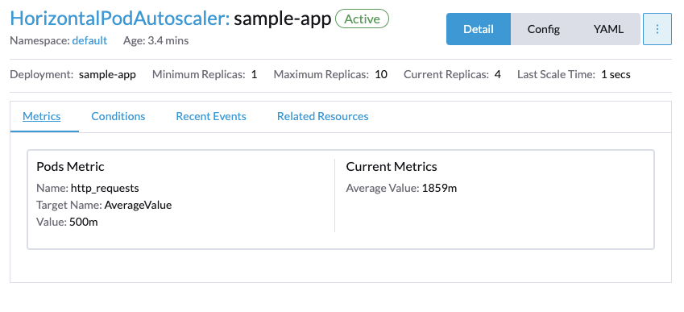

# HorizontalPodAutoscalers with custom metrics

This walkthrough will show, how you can use any metric stored in Rancher Monitoring as a source for Kubernetes' [HorizontalPodAutoscaler](https://kubernetes.io/docs/tasks/run-application/horizontal-pod-autoscale/).

## Deploying a sample app

The following deploys a sample app and exposes it through a NodePort. The app also exposes metrics for Prometheus, including a `http_requests_total` metric that shows the amount of incoming HTTP requests.

**This example is meant for demonstration purposes only and is not meant to run in production!**

[01-sample-app.yaml](./01-sample-app.yaml)

## Creating a ServiceMonitor

Next, create a ServiceMonitor so that Prometheus starts to scrape the metrics from the sample app.

[02-sample-app-service-monitor.yaml](./02-sample-app-service-monitor.yaml)

## Deploying the HorizontalPodAutoscalerConfig

Now, you can use these metrics in a HorizontalPodAutoscaler

```yaml
kind: HorizontalPodAutoscaler
apiVersion: autoscaling/v2
metadata:
  name: sample-app
spec:
  scaleTargetRef:
    apiVersion: apps/v1
    kind: Deployment
    name: sample-app
  minReplicas: 1
  maxReplicas: 10
  metrics:
  - type: Pods
    pods:
      metric:
        name: http_requests
      # target 500 milli-requests per second,
      # which is 1 request every two seconds
      target:
        type: AverageValue
        averageValue: 500m
```

## Testing the HorizontalPodAutoscaler

To test the autoscaling, do some requests against the app. Either by finding out the NodePort, or by accessing the app through a port-forward:

```shell
kubectl port-forward svc/sample-app 8080:80
ab -c 10 -n 1000 http://localhost:8080/
```

After a few seconds, you should see that the sample-app deployment will be scaled up:

```shell
watch kubectl get pods
```

You will also get more information in the events of the HorizontalPodAutoscaler:

```shell
kubectl describe hpa sample-app
```

You can also see the state of the autoscaler in the Rancher UI


