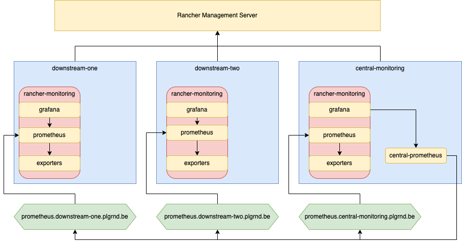
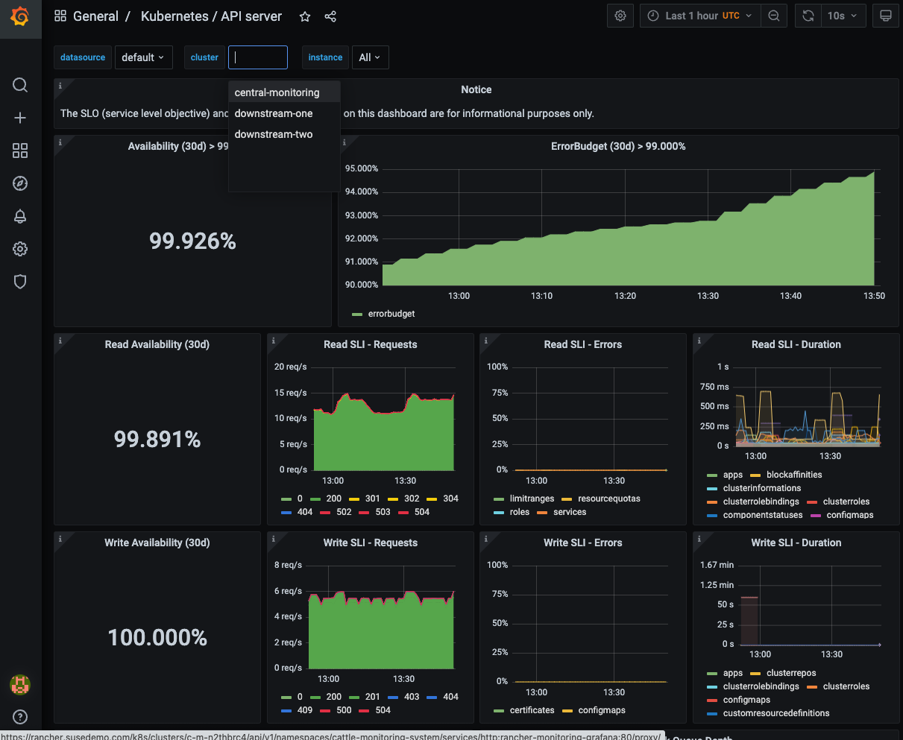

# Multi-Cluster Monitoring with Prometheus Federation

There are multiple ways how you can set up Rancher Monitoring to combine metrics of multiple clusters:

* Using Prometheus Federation so that a central Prometheus fetches metrics from the downstream Prometheus federation endpoints
* Using Prometheus remote write, so that downstream Prometheus instances push their metrics to a central Prometheus
* Using a Prometheus agent in each downstream cluster to push metrics to a central Prometheus instance
* Using Thanos to combine metrics of multiple Prometheus instances inside a Thanos object store

This walk-through explains the Prometheus federation approach.

## Prerequisites

You'll need three Kubernetes clusters:

* downstream-one
* downstream-two
* central-monitoring

Each cluster must have an ingress controller installed, ideally with a load-balancer in front and a DNS entry for the cluster's Prometheus pointing to the load-balancer/ingress-controller. To secure the traffic, we will use Let's Encrypt TLS certificates.

The following diagram illustrates the final architecture:



The [terraform-setup](./terraform-setup) example shows, how to set this up in AWS and an existing Rancher Management Server.

## Installing cert-manager into each cluster

In order to use Let's Encrypt TLS certificates, we have to install cert-manager into each cluster:

```shell
helm repo add jetstack https://charts.jetstack.io

helm install \
  cert-manager jetstack/cert-manager \
  --namespace cert-manager \
  --create-namespace \
  --version v1.8.0 \
  --set installCRDs=true
```

and create a ClusterIssuer configuration that instructs cert-manager to use Let's Encrypt http challenges to proof that we control the domain:

```shell
kubectl apply -f 00-cluster-issuer.yaml
```

## Installing Rancher Monitoring in each cluster

Next, install Rancher Monitoring into each cluster and expose this through with an Ingress and HTTP basic auth.

In each cluster, install the Rancher Monitoring CRDs and a secret which contains the HTTP basic auth username and password. This example expects an [NGINX Ingress Controller](https://kubernetes.github.io/ingress-nginx/), which is the default ingress controller in RKE1 and RKE2.

In the provided secret, the username is `foo` and the password is `bar`:

```shell
helm repo add rancher-charts https://charts.rancher.io

helm install --namespace cattle-monitoring-system rancher-monitoring-crd rancher-charts/rancher-monitoring-crd --create-namespace --wait

kubectl apply -f 02-basic-auth-secret.yaml 
```

Next install Rancher Monitoring itself and enable an ingress for Prometheus.

For the downstream-one cluster:

```shell
helm install --namespace cattle-monitoring-system rancher-monitoring rancher-charts/rancher-monitoring --create-namespace -f 01-rancher-monitoring-values-downstream-one.yaml
```

For the downstream-two cluster:

```shell
helm install --namespace cattle-monitoring-system rancher-monitoring rancher-charts/rancher-monitoring --create-namespace -f 01-rancher-monitoring-values-downstream-two.yaml
```

For the central-monitoring cluster:

```shell
helm install --namespace cattle-monitoring-system rancher-monitoring rancher-charts/rancher-monitoring --create-namespace -f 01-rancher-monitoring-values-central-monitoring.yaml
```

Note, that there are some additional changes to the Grafana configuration for the central-monitoring cluster. The grafana datasource points to an additional central-monitoring Prometheus instance, instead of the "local" Prometheus instance. And the Grafana dashboards are configured in multi-cluster mode.

## Create central prometheus

Last, we have to create the central Prometheus instance in the central-monitoring cluster:

```shell
kubectl create namespace central-monitoring-system
kubectl apply -f 03-central-prometheus.yaml
```

This Prometheus will be configured to scrape metrics from the federation endpoints of the 3 other Prometheus instance. The scrape config also includes a relabeling configuration, which ensures that each metric has a cluster label with the name of the cluster, where the metric came from and still contains the original instance and job labels, to make the metrics work with the pre-defined Grafana dashboards.

After Prometheus is up and running, navigate to the central monitoring cluster and access Grafana from the Monitoring section. This Grafana now connects to the central-monitoring Prometheus, which contains metrics from all clusters. And all the dashboards have an additional cluster filter:


