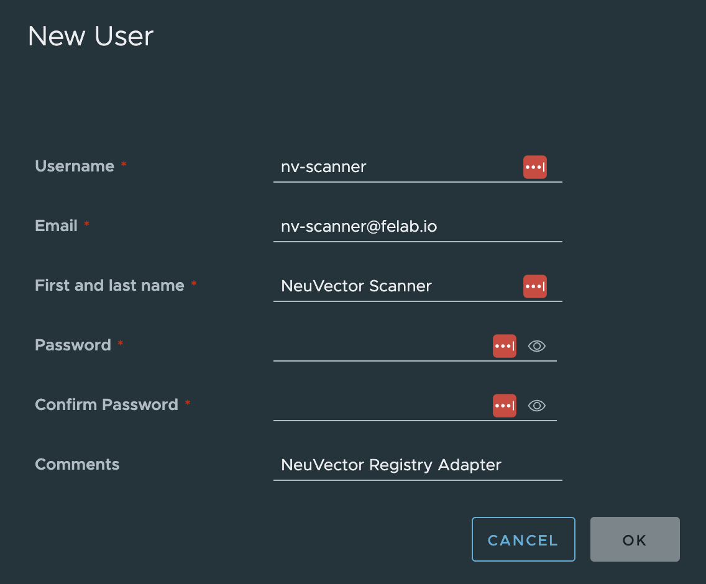
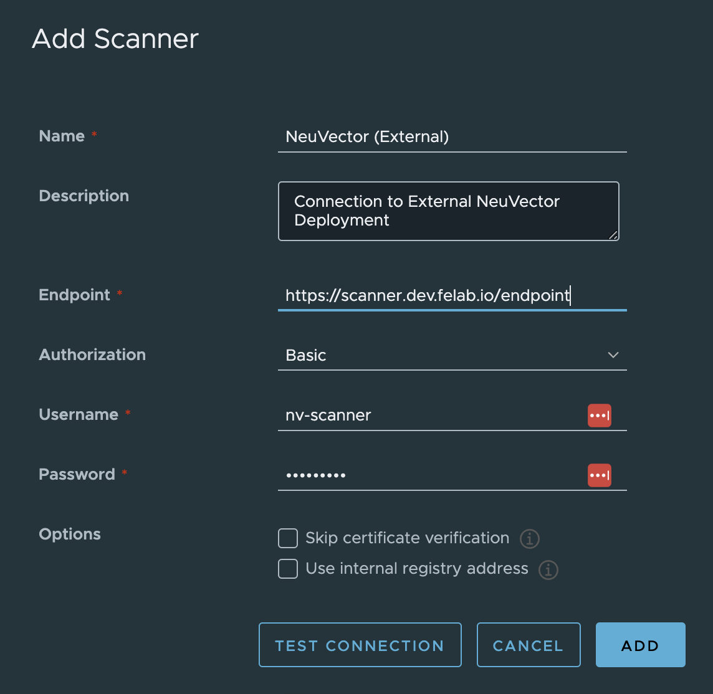
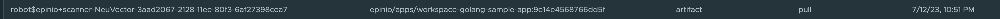

# Installing and Configuring NeuVector Harbor Registry Adapter

Starting from [NeuVector version 5.2](https://open-docs.neuvector.com/releasenotes/5x#enhancements), it is possible to use NeuVector's Scanner as a Harbor Interrogation Service.

## Credentials for Harbor

Firstly, we need to create a Harbor user account for the NeuVector Registry Adapter connection.  It is not neccessary to give this account Admin privileges:



Next, a `Secret` containing the same must be created in the Namespace our Cluster's Neuvector deployment resides:

```yaml
apiVersion: v1
kind: Secret
metadata:
  name: adapter-credentials
  namespace: <Helm-Release-Namespace>
data:
  password: UGFzc3cwcmQh
  username: bnYtc2Nhbm5lcgo=
```

After the Harbor user account setup is finished, the Registry Adapter can be deployed to an [existing NeuVector 5.2+ instance](#existing-neuvector-installation) *or* to a K8s cluster [hosting the Harbor instance](#self-hosted-installation).

## Existing NeuVector Installation

>:memo: Follow this section to add the Registry Adapter to an existing NeuVector installation.

To facilitate external connectivity, this example enables the Registry Adapter's `Ingress` resource in NeuVector's 2.6.0+ Helm chart and optionally leverages an existing Let's Encrypt Issuer to provide a vaild SSL certificate. A `LoadBalancer` or `NodePort` Service could also be used if desired:

```yaml
cve:
  adapter:
    enabled: true
    ingress:
      annotations:
        cert-manager.io/issuer: letsencrypt-production
        cert-manager.io/issuer-kind: Issuer
      enabled: true
      host: <your-awesome-scanner-URL.goes.here>
      path: "/"
      secret: adapter-ingress
      tls: true
    svc: ClusterIP
  harbor:
    secretName: adapter-credentials
```

## "Self-Hosted" Installation

>:memo: In this scenario, not *all* of NeuVector's core components (i.e. Web UI) will be deployed.

This Helm values file will only install components needed for the Registry Adapter and Scanner.  Also configured is Scanner Autoscaling to dynamically scale **up** or **down** Scanner pod replicas based on demand.  No `Ingress` or `NodePort` services are needed in this scenario.

```yaml
controller:
  apisvc:
    type: ClusterIP
  configmap:
    data:
      sysinitcfg.yaml: |
        Scanner_Autoscale:
          Strategy: delayed
          Min_Pods: 1
          Max_Pods: 3
    enabled: true
  replicas: 1
cve:
  adapter:
    enabled: true
    harbor:
      secretName: adapter-credentials
    svc:
      type: ClusterIP
enforcer:
  enabled: false
# 'k3s' is enabled for K3s or RKE2 K8s distributions. Other valid container runtime options are 'bottlerocket', 'containerd','crio', or 'docker'.
k3s:
  enabled: true
manager:
  enabled: false
serviceAccount: neuvector
```

## Adding NeuVector Scanner to Harbor Interrogation Services

To add NeuVector, navigate to `Interrogation Services` in the Harbor UI, click `+ NEW SCANNER` and fill in the details:

| TITLE | FIELD | NOTES |
|:-------------|:------|:-----|
| Name         | Scanner Display Name | Required |
| Description  | Scanner Description | Optional |
| Endpoint     | Ingress URL or IP/FQDN  | Required (i.e `https://<your-URL>/endpoint` or `https://<your-IP>:portNumber/endpoint`) |
| Authorization| Basic |  |
| Username     | Username from Secret |  |
| Password     | Password from Secret |  |
| Options      | | :warning: If using self-signed or Staging cert, ensure `Skip certificate verification`  is checked. |



>:memo: For "self-hosted" scanner instances, the default `Endpoint` will be:
`https://neuvector-service-registry-adapter.<Helm-Release-Namespace>.svc.cluster.local:9443/endpoint`

## Verification

After adding the scanner, its Health Status should change to `Healthy` within a few seconds. It can also be selected as `Default` should you choose.


To verify the Neuvector Scanner is behaving as expected, we can look into the Harbor logs for NeuVector Entries:



Additionally, if the the NeuVector deployment includes the manager UI, we can see scan results under `Notifications > Risk Reports`:


